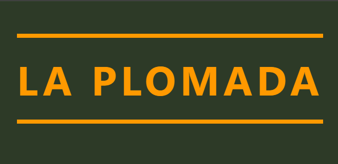

<p align="center">
  
</p>

<h1 align="center">La Plomada</h1>
<p align="center">Tienda online de artículos de pesca — Trabajo Práctico Desarrollo Web</p>

<p align="center">
  
  
  
  
</p>

---

## Descripción

**La Plomada** es una plataforma de e-commerce desarrollada con Laravel para la venta de productos de pesca. Permite a los clientes explorar el catálogo, agregar productos al carrito y realizar compras, mientras que los administradores gestionan el inventario, pedidos y usuarios desde un panel dedicado.

### Funcionalidades principales

- Catálogo con filtros por categoría y orden por precio
- Carrito de compras con selección de variantes
- Proceso de compra con elección de envío y método de pago
- Historial de pedidos por usuario
- Reseñas de productos
- Panel de administración (productos, categorías, ventas, usuarios, consultas)
- Autenticación completa con Laravel Breeze

---

## Documentación

| Documento | Descripción |
|---|---|
| [Manual de usuario](docs/manual_usuario.md) | Guía de uso para clientes y administradores |
| [Guía de instalación](docs/guia_instalacion.md) | Cómo instalar y configurar el proyecto localmente |
| [DER](docs/der.md) | Diagrama entidad-relación de la base de datos |

---

## Instalación rápida

```bash
# 1. Instalar dependencias
composer install
npm install

# 2. Configurar entorno
cp .env.example .env
php artisan key:generate

# 3. Importar la base de datos
# Crear la DB "db_la_plomada" en HeidiSQL e importar el archivo db_la_plomada.sql

# 4. Enlazar storage y compilar
php artisan storage:link
npm run dev
```

Acceder en: `http://la-plomada.test`

> Para el detalle completo ver la [Guía de instalación](docs/guia_instalacion.md).

---

## Credenciales de prueba

| Rol | Email | Contraseña |
|---|---|---|
| Administrador | antonio@gmail.com | antoniolaravel |
| Cliente | comprar@gmail.com | compradorlaravel |

---

## Stack tecnológico

| Capa | Tecnología |
|---|---|
| Backend | Laravel 12 (PHP 8.2+) |
| Autenticación | Laravel Breeze |
| Base de datos | MariaDB + Eloquent ORM |
| Entorno local | Laravel Herd |
| Cliente DB | HeidiSQL |
| Frontend | Blade + Vite |

---

## Licencia

Proyecto académico — uso educativo.
