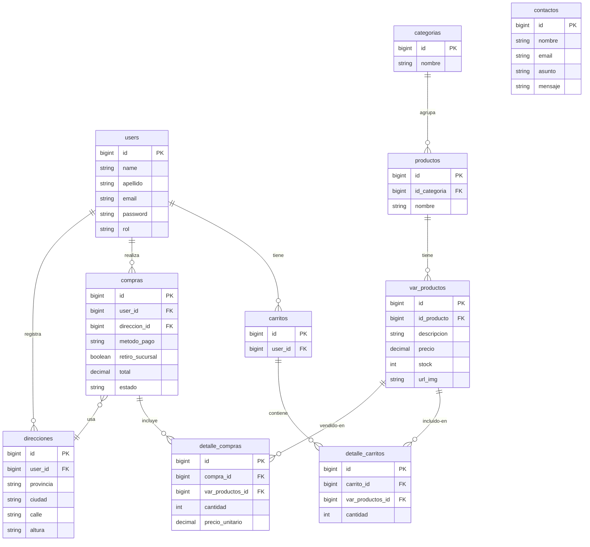

# Diagrama Entidad-Relación — La Plomada

```mermaid
erDiagram
  users {
    bigint id PK
    string name
    string apellido
    string email
    string password
    string rol
  }
  categorias {
    bigint id PK
    string nombre
  }
  productos {
    bigint id PK
    bigint id_categoria FK
    string nombre
  }
  var_productos {
    bigint id PK
    bigint id_producto FK
    string descripcion
    decimal precio
    int stock
    string url_img
  }
  direcciones {
    bigint id PK
    bigint user_id FK
    string provincia
    string ciudad
    string calle
    string altura
  }
  carritos {
    bigint id PK
    bigint user_id FK
  }
  detalle_carritos {
    bigint id PK
    bigint carrito_id FK
    bigint var_productos_id FK
    int cantidad
  }
  compras {
    bigint id PK
    bigint user_id FK
    bigint direccion_id FK
    string metodo_pago
    boolean retiro_sucursal
    decimal total
    string estado
  }
  detalle_compras {
    bigint id PK
    bigint compra_id FK
    bigint var_productos_id FK
    int cantidad
    decimal precio_unitario
  }
  contactos {
    bigint id PK
    string nombre
    string email
    string asunto
    string mensaje
  }

  users         ||--o{ carritos         : tiene
  users         ||--o{ compras          : realiza
  users         ||--o{ direcciones      : registra
  categorias    ||--o{ productos        : agrupa
  productos     ||--o{ var_productos    : tiene
  carritos      ||--o{ detalle_carritos : contiene
  var_productos ||--o{ detalle_carritos : incluido-en
  compras       ||--o{ detalle_compras  : incluye
  var_productos ||--o{ detalle_compras  : vendido-en
  compras       }o--|| direcciones      : usa
```
